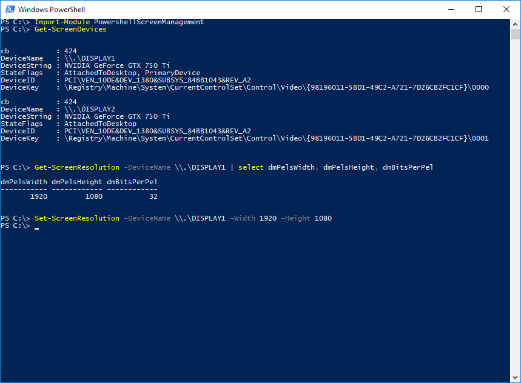
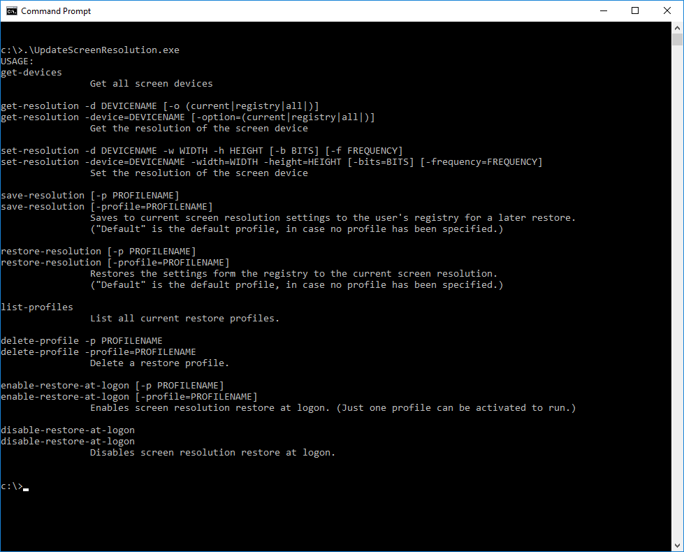

# ScreenResolution
Show, Update ScreenResolution with powershell or cmd.

Features:
  * Powershell Module to:
    * get the screen resolution (current, all supported)
    * set the current screen resolution
  * Executable (UpdateScreenResolution.exe) to:
    * get the screen resolution (current, all supported)
    * set the current screen resolution
    * save current screen resolution to the registry
    * restore the screen resolution  to the registry
    * automatically restore the screen resolution at logon
    * save screen resolution to different backup profiles and restore them on demand

